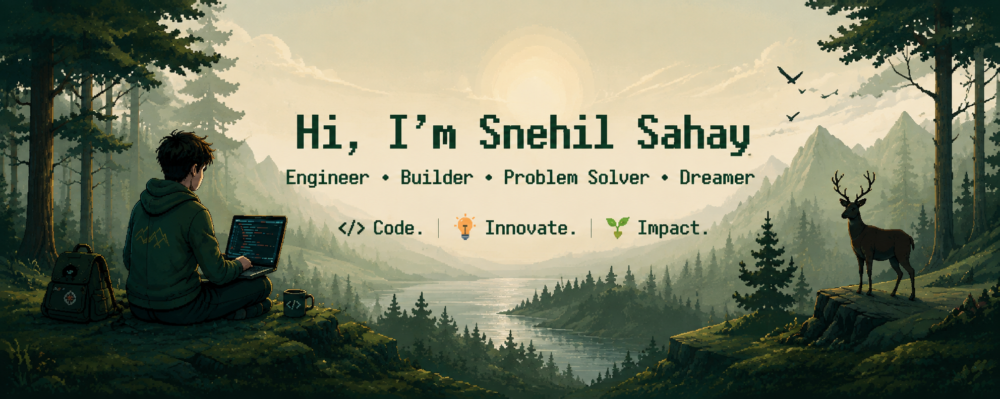

<!-- ==================== HERO ==================== -->

  

  

  

  
  
  

  

---

<!-- ==================== CURRENT WORK ==================== -->
<h2 align="center">🚀 What I'm Building</h2>

<table align="center">
  <tr>
    <td width="50%" valign="top">
      <h3>🚨 AutoRescue</h3>
      <b>Disaster Detection & Emergency Technology</b>
      
A disaster-response system designed to help people in disaster-prone environments through intelligent detection, communication and emergency assistance.

      

        
        
        
        
      

    </td>
    <td width="50%" valign="top">
      <h3>🏎️ Intelligent Systems</h3>
      <b>Hyperloop • Embedded • AI</b>
      
Working on software and intelligent systems for next-generation transportation, telemetry, sensors and embedded computing.

      

        
        
        
        
      

    </td>
  </tr>
  <tr>
    <td width="50%" valign="top">
      <h3>🎓 Acadloop</h3>
      <b>Campus Super-App</b>
      
A one-stop platform for students to check attendance and marks, ask questions anonymously, discover campus rooms and the library, browse the food court, and connect with everything happening on campus.

      

        
        
        
        
      

    </td>
    <td width="50%" valign="top">
      <h3>🔍 Visual Product Search</h3>
      <b>CLIP + FAISS • Counterfeit Detection</b>
      
A unified multimodal embedding pipeline on Amazon's ABO dataset for visual search, near-duplicate detection, and counterfeit listing identification — with Grad-CAM explainability and a live Gradio demo.

      

        
        
        
        
      

    </td>
  </tr>
</table>

---

<!-- ==================== AREAS ==================== -->
<h2 align="center">🧠 What I Like Building</h2>

  
  
  
  
   
  
  
  
  

---

<!-- ==================== CURRENTLY LEARNING ==================== -->
<h2 align="center">🌱 Currently Exploring</h2>

  

  

---

<!-- ==================== TECH STACK ==================== -->
<h2 align="center">🛠️ Technology Stack</h2>

  <b>Languages</b>  
  
    
  <b>Frontend & Mobile</b>  
  
    
  <b>Backend & Database</b>  
  
    
  <b>Tools & Platforms</b>  
  

---

<!-- ==================== DEVELOPER LOOP ==================== -->
<h2 align="center">⚡ The Developer Loop</h2>

  💡 IDEA → 🔍 EXPLORE → 🧠 LEARN → 🛠 BUILD → 💥 BREAK → 🔧 DEBUG → 🚀 SHIP → ✨ REPEAT

  

---

<!-- ==================== GITHUB STATS ==================== -->
<h2 align="center">📊 GitHub Activity</h2>

  
  

  

  

  

---

<!-- ==================== ABOUT ME ==================== -->
<h2 align="center">🎯 A Little More About Me</h2>

  💭 I enjoy asking <b>"What if?"</b>  
  🔧 I like turning ideas into prototypes  
  🧠 I enjoy understanding how things work under the hood  
  🚀 I prefer building projects over just collecting tutorials  
  🌎 I'm interested in technology that can create real-world impact

---

<!-- ==================== CONTACT ==================== -->
<h2 align="center">📫 Let's Connect</h2>

  
  
  

---

<!-- ==================== FOOTER ==================== -->

  

<i>"Code is like humor. When you have to explain it, it's bad."</i> ✨

  

